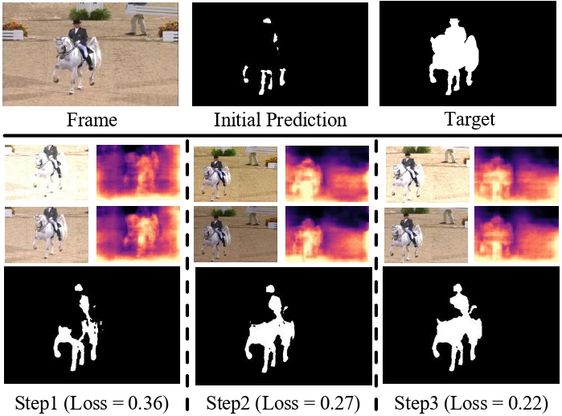
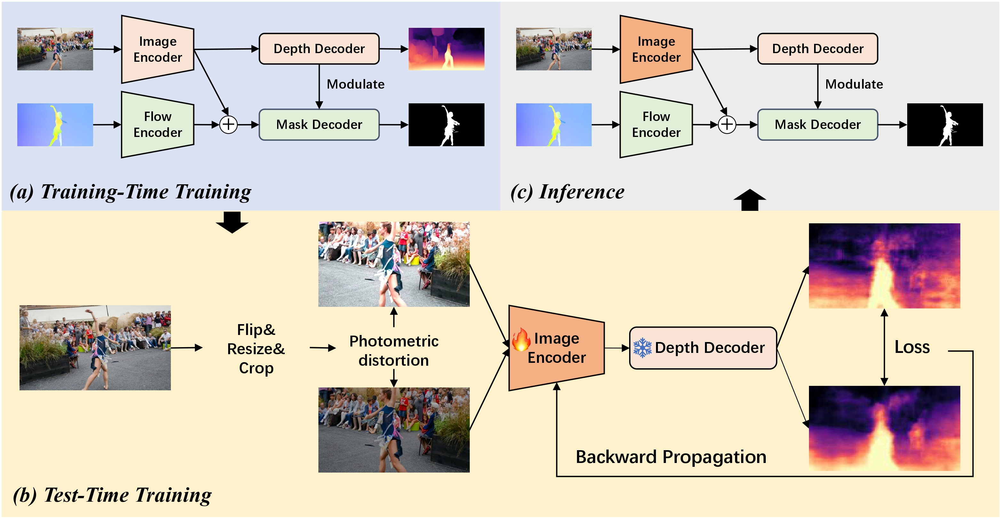

<div align="center">

<h3> Depth-aware Test-Time Training for Zero-shot Video Object Segmentation
 </h3> 
 <br/>
  <a href='https://arxiv.org/abs/2403.04258'></a> 
  <a href='https://nifangbaage.github.io/DATTT/'></a>
  <br/>
  <br/>
<div>
    <a target='_blank'>Weihuang Liu <sup> 1</sup> </a>&emsp;
    <a href='https://xishen0220.github.io/' target='_blank'>Xi Shen <sup> 2</sup></a>&emsp;
    <a target='_blank'>Haolun Li <sup> 1</sup> </a>&emsp;
    <a target='_blank'>Xiuli Bi <sup> 3</sup> </a>&emsp;
    <a target='_blank'>Bo Liu <sup> 3</sup> </a>&emsp;
    <a href='https://www.cis.um.edu.mo/~cmpun/' target='_blank'>Chi-Man Pun <sup>*,1</sup></a>&emsp;
    <a href='https://vinthony.github.io/' target='_blank'>Xiaodong Cun <sup>*,4</sup></a>&emsp;
</div>
<br>
<div>
                      <sup>1</sup> University of Macau &nbsp;&nbsp;&nbsp;
                      <sup>2</sup> Intellindust&nbsp;
                    <br>
                      <sup>3</sup> Chongqing University of Posts and Telecommunications&nbsp;&nbsp;
                      <sup>4</sup> Tencent AI Lab
</div>
<br>
<i><strong><a href='https://arxiv.org/abs/2403.04258' target='_blank'>CVPR 2024</a></strong></i>
<br>
<br>
</div>

## Overview
<p align="center">
  
</p>
Mainstream solutions mainly focus on learning a single model on large-scale video datasets, which struggle to generalize to unseen videos.
We introduce Depth-aware test-time training (DATTT) to address the problem. 
Our key insight is to enforce the model to predict consistent depth during the TTT process.
During the test-time training, the model is required to predict consistent depth maps for the same video frame under different data augmentation. 
The model is progressively updated and provides more precise mask prediction. 

## Pipeline
<p align="center">
  
</p>
We add a depth decoder to commonly used two-stream ZSVOS architecture to learn 3D knowledge. 
The model is first trained on large-scale datasets for object segmentation and depth estimation. 
Then, for each test video, we employ photometric distortion-based data augmentation to the frames. 
The error between the predicted depth maps is backward to update the image encoder. 
Finally, the new model is applied to infer the object.

## Environment
This code was implemented with Python 3.6 and PyTorch 1.10.0. You can install all the requirements via:
```bash
pip install -r requirements.txt
```

## Quick Start
1. Download the [YouTube-VOS dataset](https://youtube-vos.org/dataset/), [DAVIS-16 dataset](https://davischallenge.org/), [FBMS dataset](https://lmb.informatik.uni-freiburg.de/resources/datasets/), [Long-Videos dataset](https://www.kaggle.com/datasets/gvclsu/long-videos), [MCL dataset](http://mcl.korea.ac.kr/database/saliency/), and [SegTrackV2 dataset](https://web.engr.oregonstate.edu/~lif/SegTrack2/dataset.html). You could get the processed data provided by [HFAN](https://github.com/NUST-Machine-Intelligence-Laboratory/HFAN).
   The depth maps are obtained by [MonoDepth2](https://github.com/nianticlabs/monodepth2),
   We also provide the processed data [here](https://drive.google.com/file/d/12pMEL_fA9VOudrb_uAFFc1gVM-O52z6R/view?usp=drive_link).
2. Download the pre-trained [Mit-b1](https://github.com/NVlabs/SegFormer) or [Swin-Tiny](https://github.com/microsoft/Swin-Transformer) backbone.
3. Training:
```bash
python train.py --config ./configs/train_sample.yaml
```
4. Evaluation:
```bash
python ttt_demo.py --config configs/test_sample.yaml --model model.pth --eval_type base
```
5. Test-time training:
```bash
python ttt_demo.py --config configs/test_sample.yaml --model model.pth --eval_type TTT-MWI
```
We provide our checkpoints [here](https://drive.google.com/file/d/1HukrYVNiUwLpWCQ435oPVeqjW1drzBRj/view?usp=drive_link).

## Citation
If you find this useful in your research, please consider citing:
```
@inproceedings{
title={Depth-aware Test-Time Training for Zero-shot Video Object Segmentation},
author={Weihuang Liu, Xi Shen, Haolun Li, Xiuli Bi, Bo Liu, Chi-Man Pun, Xiaodong Cun},
booktitle={Proceedings of the IEEE/CVF Conference on Computer Vision and Pattern Recognition},
year={2024}
}
```


## Acknowledgements

EVP code borrows heavily from [EVP](https://github.com/NiFangBaAGe/Explicit-Visual-Prompt), [Swin](https://github.com/microsoft/Swin-Transformer) and [SegFormer](https://github.com/NVlabs/SegFormer). We thank the author for sharing their wonderful code. 
